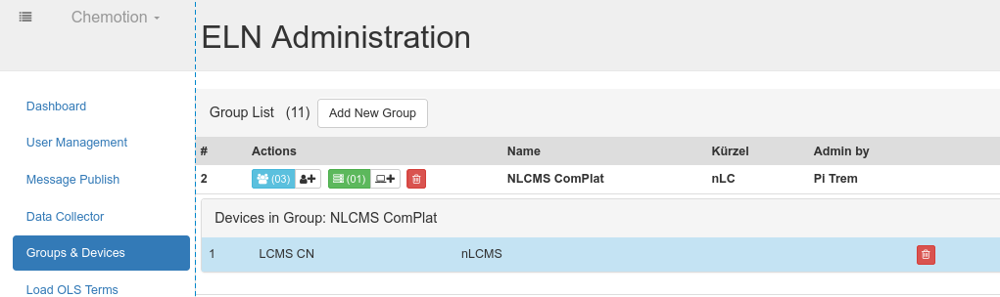

## user name_abbreviation
Name abbreviation, like emails, are unique in the DB and can be used for sign in.
the length of if can be defined in the user_props.yml config file

```sh
# from the application dir (/var/www/chemotion_ELN/current) copy the config file 
cp config/user_props.yml.example config/user_props.yml

# edit it
vim config/user_props.yml

# restart the application (assuming Passenger is being used)
touch tmp/restart.txt

# keep the configuration for future ELN updates (assuming Capistrano is used)
mv config/user_props.yml /var/www/chemotion_ELN/shared/config/user_props.yml
ln -s  /var/www/chemotion_ELN/shared/config/user_props.yml /var/www/chemotion_ELN/current/config/user_props.yml
```


## secret key 
used for cookie encryption.
stored in **.env** file

## Email-service
For sending users account email confirmation request, reset password instructions, or other notifications.
 
Email configuration parameters are set as environment variables in the **.env** file. 
belwo a list of available parameters

```sh
# address of your ELN for url-links in emails:
SMTP_HOST='sld.tld' 
# senders email:
DEVISE_SENDER='no-reply@sld.tld' 
SMTP_ADDRESS='smtp.sld.tld'
SMTP_PORT=587
# login email:
SMTP_USERNAME='no-reply@sld.tld' 
SMTP_PASSWORD='s3cr3tPW'
SMTP_DOMAIN='sld.tld'
SMTP_TLS=true
SMTP_AUTH='plain'
SMTP_SSL_MODE='none'

```


## File collector (doi: )

data files can be collected from remote storages and distributed to specific user based on the filename matching the user's name abbreviation.

several options are available:
- collecting attachments from emails
- collecting file or folder from local drives or over scp

The background worker will collect the files at the frequencies set.
If login credentials are needed, those are set in the configuration file as well.

Each collection job should be associated to a device account through the administrator interface


## External services 

## Chemspectra-App

source: https://github.com/complat/chem-spectra-app

installation: https://github.com/ComPlat/chem-spectra-app/blob/master/INSTALL.md

-- setting

```sh
# from the application dir (/var/www/chemotion_ELN/current) copy the config file 
cp config/spectra.yml.example config/spectra.yml

# edit it
vim config/spectra.yml

# restart the application (assuming Passenger is being used)
touch tmp/restart.txt

# keep the configuration for future ELN updates (assuming Capistrano is used)
mv config/spectra.yml /var/www/chemotion_ELN/shared/config/spectra.yml
ln -s  /var/www/chemotion_ELN/shared/config/spectra.yml /var/www/chemotion_ELN/current/config/spectra.yml
```

## VNC
Access  remote Desktop with VNC using websockify
install https://github.com/novnc/websockify

setting through the Administrator-interface


Access to the remote can then be given to a user by associating it and the device within a user-group.
Administrator can assign devices and users to exisiting group.


User can assign others to the groups they manage.


## Onlyoffice

install  [OnlyOffice](https://helpcenter.onlyoffice.com/installation/docs-community-install-ubuntu.aspx?_ga=2.2091185.1060566386.1612303438-123622021.1612303437) instance on a server

```sh
# from the application dir (/var/www/chemotion_ELN/current) copy the config file 
cp config/editors.yml.example config/editors.yml

# edit it
vim config/editors.yml

# restart the application (assuming Passenger is being used)
touch tmp/restart.txt

# keep the configuration for future ELN updates (assuming Capistrano is used)
mv config/editors.yml /var/www/chemotion_ELN/shared/config/editors.yml
ln -s  /var/www/chemotion_ELN/shared/config/editors.yml /var/www/chemotion_ELN/current/config/editors.yml
```

## Computed properties 

source:
installation:  

hint: Turbomols license needed
settings the computed-properties can be done directly from the Admin-UI, and are saved in the DB

Application will need to be restarted


