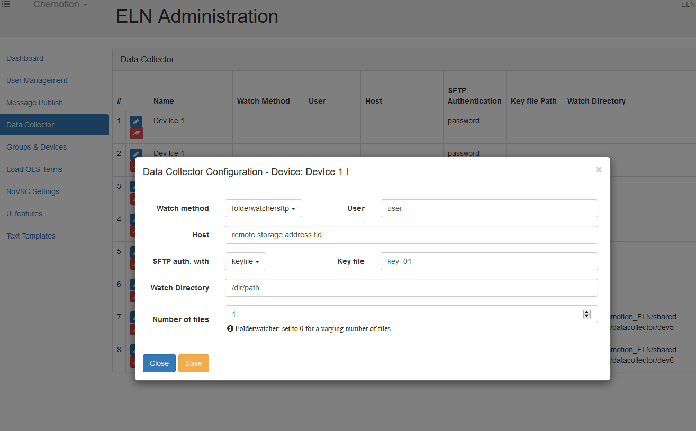
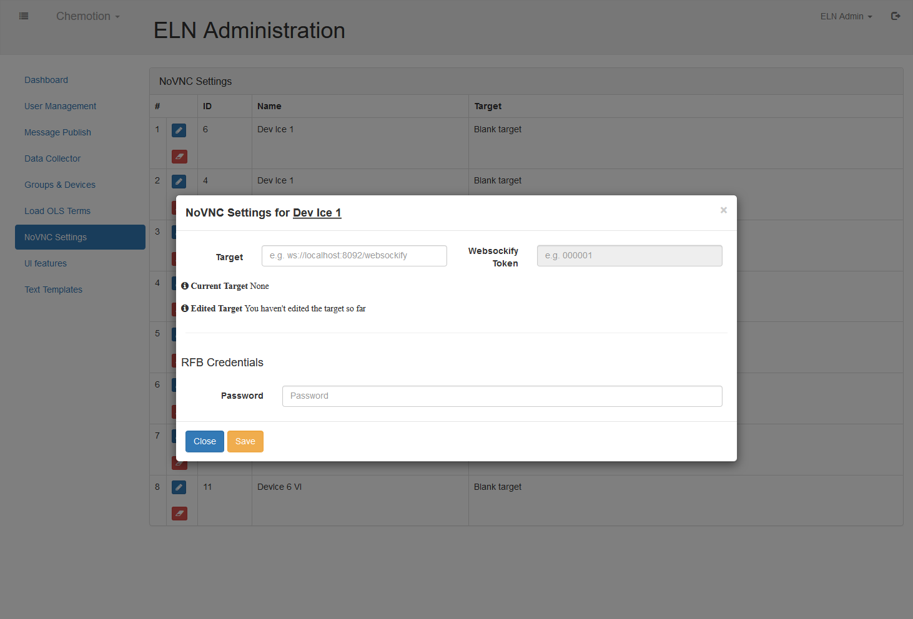
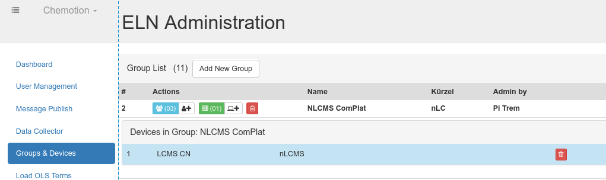
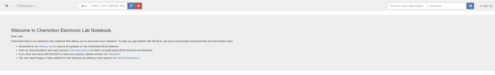

:::info Info 
This page is still being edited and reviewed.
::: 

## User name_abbreviation
Name abbreviation, like e-mails, are unique in the DB and can be used for sign in.
The length of it can be defined in the `user_props.yml` configuration file:

```sh
# from the application dir (/var/www/chemotion_ELN/current) copy the config file 
cp config/user_props.yml.example config/user_props.yml

# edit it
vim config/user_props.yml

# restart the application (assuming Passenger is being used)
touch tmp/restart.txt

# keep the configuration for future Chemotion ELN updates (assuming Capistrano is used)
mv config/user_props.yml /var/www/chemotion_ELN/shared/config/user_props.yml
ln -s  /var/www/chemotion_ELN/shared/config/user_props.yml /var/www/chemotion_ELN/current/config/user_props.yml
```


## Secret key 
used for cookie encryption.
stored in <b>.env</b> file

## Structure editor

Configure the license and required files for using ChemDraw editor or Marvin JS editor.

setting:

## e-mail-service (optional)

For sending users account e-mail confirmation request, reset password instructions, or other notifications.
 
e-mail configuration parameters are set as environment variables in the <b>.env</b> file.
below a list of available parameters:

```sh
# default url of your Chemotion ELN for http links in e-mails:
SMTP_HOST='sld.tld' 
# senders e-mail:
DEVISE_SENDER='no-reply@sld.tld' 

## SMTP config 
# Remote mail server
SMTP_ADDRESS='smtp.sld.tld'
SMTP_PORT=587
# login user name & password:
SMTP_USERNAME='no-reply@sld.tld' 
SMTP_PASSWORD='s3cr3tPW'
# optional, HELO domain
SMTP_DOMAIN='sld.tld'
# detect STARTTLS
SMTP_TLS=true
# authentication type ('plain' 'login' (Base64 encoded) or 'cram_md5')
SMTP_AUTH='plain'
# how OpenSSL checks the certificate  ('none' or 'peer') 
SMTP_SSL_MODE='none'
```

See [rails docs](https://guides.rubyonrails.org/action_mailer_basics.html#action-mailer-configuration) for an explanation of the parameters.


## File collector 

This is an optional service to collect data files and distribute them to the Chemotion ELN inbox of the respective users.

(see the [devices overview](devices) or [doi: 10.1016/j.acax.2019.100007 ](https://doi.org/10.1016/j.acax.2019.100007 ))

Two options are available:
- collecting attachment files from e-mails
- collecting file or folder from local drives or over scp

### e-mail-attachement collection 

The Chemotion ELN-app should be given access to an e-mail account in which it will regularly check for incoming e-mails and collect the attachments.
The attachments are then distributed to Chemotion ELN user by matching the additional addressee present in the __To:__ or __CC:__ fied of the e-mail. The sender's e-mail address should also one of an Chemotion ELN-registered device. 

:::danger 
All new incoming e-mails are processed and discarded. 
If the sender and other addresssees are unknown to the Chemotion ELN (e-mails registered to Chemotion ELN accounts), then the e-mail will be directly deleted.
:::


### File collection

Files can be collected from remote storages and distributed to specific user based on the file-name matching the user's name abbreviation.

:::danger 
The directories watched by the collector service will be emptied at each collection i. e. all files within the watched directories will be removed.
:::


### Data-collector settings

Configure the frequency for collecting the files, as well as the e-mail access in the `config/datacollectors.yml` file.
The background worker will collect the files at the frequencies set.
If login credentials are needed, those are set in the configuration file as well.

```sh
### example of configdatacollector.yml 
production:
  :services:
    - :name: 'mailcollector'
      :cron: '5,20,35,50 * * * *' # every 15 minutes starting a xx:05
    - :name: 'folderwatchersftp'
      :every: 5 # minutes
      :watcher_sleep: 30 # seconds
    - :name: 'folderwatcherlocal'
      :every: 5 # minutes
      :watcher_sleep: 30 # seconds
    - :name: 'filewatchersftp'
      :every: 2 # minutes
    - :name: 'filewatcherlocal'
      :every: 2 # minutes

  ## Chemotion ELN e-mail account
  :mailcollector:
    :server: 'imap.server.de'
    :mail_address: "service@mail"
    :password: "password"
    # :port: 993 default
    # :ssl: true default
    :aliases:
      - 'alias_one@kit.edu'
      - 'alias_two@kit.edu'
  
  ## File collection over ssh with password 
  :sftpusers:
    - :user: 'user1'
      :password: 'pass'
    - :user: 'user2'
      :password: 'pass'

  # Dir of ssh keys for data collection over sftp
  :keydir: 'config/data_collector_keys'

  # Allowlist of dir paths for local data collection
  :localcollectors:
    - :path: '<%= Rails.root.join(*%w[tmp datacollector]).to_s %>'
```

:::info NB
After editing the datacollectors.yml the worker service (DelayedJob) needs to be restarted.
:::

For each registered Device, a collection job can be set up through the administrator interface:




## External services 

### ChemSpectra-App

source: https://github.com/complat/chem-spectra-app

installation: https://github.com/ComPlat/chem-spectra-app/blob/master/INSTALL.md

setting: 

```sh
# from the application dir (/var/www/chemotion_ELN/current) copy the config file 
cp config/spectra.yml.example config/spectra.yml

# edit it
vim config/spectra.yml

# restart the application (assuming Passenger is being used)
touch tmp/restart.txt

# keep the configuration for future Chemotion ELN updates (assuming Capistrano is used)
mv config/spectra.yml /var/www/chemotion_ELN/shared/config/spectra.yml
ln -s  /var/www/chemotion_ELN/shared/config/spectra.yml /var/www/chemotion_ELN/current/config/spectra.yml
```

### VNC
Access  remote Desktop with VNC using websockify

installation: https://github.com/novnc/websockify

setting: through the Administrator-interface



Access to the remote can then be given to a user by associating it and the device within a user-group.
Administrators can assign devices and users to exisiting group.


User can assign others to the groups they manage.


### Onlyoffice

Install [OnlyOffice](https://helpcenter.onlyoffice.com/installation/docs-community-install-ubuntu.aspx?_ga=2.2091185.1060566386.1612303438-123622021.1612303437) instance on a server:

```sh
# from the application dir (/var/www/chemotion_ELN/current) copy the config file 
cp config/editors.yml.example config/editors.yml

# edit it
vim config/editors.yml

# restart the application (assuming Passenger is being used)
touch tmp/restart.txt

# keep the configuration for future Chemotion ELN updates (assuming Capistrano is used)
mv config/editors.yml /var/www/chemotion_ELN/shared/config/editors.yml
ln -s  /var/www/chemotion_ELN/shared/config/editors.yml /var/www/chemotion_ELN/current/config/editors.yml
```

### Computed properties 

source:
installation:  

hint: Turbomols license needed
settings the computed-properties can be done directly from the Admin-UI, and are saved in the DB

Application will need to be restarted

## Dynamic Welcome e-mail and Message (optional)

:::caution
This feature is still in Beta version.
:::

This configuration enables sending a welcome message as an e-mail to the new users upon registration. It also displays the same content as a welcome message at the home page. The content is dynamic and can be modified and updated anytime.



The message is rendered via .md file, you can find the sample file [here.](https://github.com/ComPlat/chemotion_ELN/blob/development-5/public/welcome-message-sample.md)
In order to configure this, you just need to create a similar file as above in the same `public` directory named as `welcome-message.md`. You can copy the content from the sample file and modify the message as you wish.

:::note
Restarting of server might be required if you are adding the file to an already running instance.
:::
