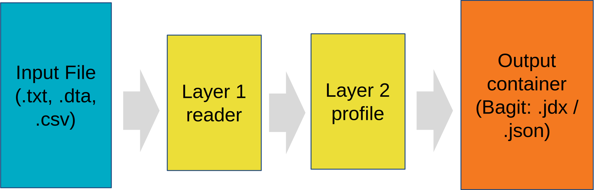

:::info Info
This page is still being edited and reviewed.
:::

# Overview of the Converter functions

The purpose of the Chemotion Converter (in short: ChemConverter) is to convert different file formats and types from [integrated devices](/docs/eln/devices) to a common and well known data type, namely e.g. jcamp .jdx or .json.
It is also possible to extract columns for 2D data visualization and Metadata.
Currently, the ChemConverter can handle most text readable files like txt/csv/dta if they are properly structured, but developers can create their own readers if a rule is notable for the newly added file type.

Most of the time, the ChemConverter runs as a background process when the user or a measurement device uploads a analytic file to the ELN.
The prerequisite is that an admin has created a suitable [profile](/docs/eln/converter/converter_profile).
There is also a standalone version of the converter which you can find and install from [Github](https://github.com/jochenklar/chemotion-converter-app).

## Technical aspect

Technically the converter is built based on three layers, namely the reader, the admin GUI and last but not least the upload & processing.
The creator of reader requires mostly knowledge in (e.g python) coding while the admin of the second layer has to know the measurement technique and device very well, because it decides which info the use will get and see at the end of the third layer.
The last layer is a simple Webapp executing the code or an automated process during the file upload.
How the files are converted will be decided by specific rules which are listening on predefined identifiers.

### First layer: The reader

The reader is one part of programming code responsible for the software to import and handle the given data format.
It is the most powerfull layer due to flexibility (e.g. calculation of custom Metadata or special and complex column rules and calculations). 

Source codes for the readers and examples can also be found on [Github](https://github.com/jochenklar/chemotion-converter-app/tree/master/converter_app/readers).
There are readers for common file types and specific ones which are heirs of the basic ones.
The following list shows some (but not all) of the current readers available:
* ASCII (aka simple TXT)
* CSV
  * NOVA (Specific reader for an instrument without Metadata, also an example for custom Metadata calculation)
* DTA

### Second layer: The admin Profile creation GUI

The final rules to convert a data file into a standardized Bagit-it-zip-Container containing .jdx/.json files will be determined by profiles.
Which profile is responsible is determined via identifiers.
Like in case of the readers almost eyerthing the input file contains can be used as an identifier, as long as the sum of identifiers for one profil is unique.
The most common identifiers are:
* The file extension (.txt, .csv, .dta, ...)
* The first human readable line(s) of the header
* The data column titles 

### Third layer: Upload, processing and output

 
