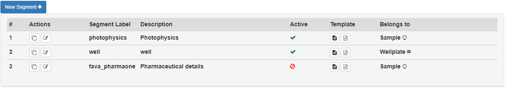
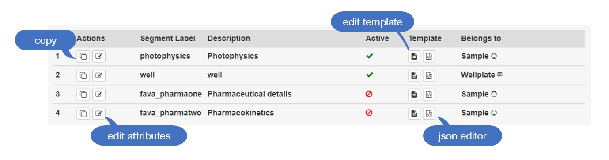
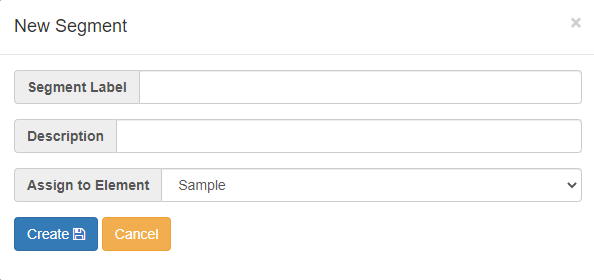

import { FontAwesomeIcon } from '@fortawesome/react-fontawesome' 
import { faClone, faPencilSquareO, faFileText, faFileCodeO, faPlus, faChartBar, faCheck, faSave, faAngleRight, faTrashAlt, faPaste, faArrowsAlt, faSyncAlt, faChartArea, faClock, faHourglassHalf, faHourglassEnd, faEllipsisH,faCheckCircle, faTimesCircle, faDownload } from '@fortawesome/free-solid-svg-icons' 
import {Btn} from '../btn.js' 

:::danger Caution 
This page is still being edited and reviewed.
::: 

## Generic Segments and Elements

Generic elements and segments are structured according to the different levels **layer** and **field**. Each generic element or segment can contain different, multiple **layers** and each layer can consist of multiple and differnt **fields**. 

## Generic Segments

Generic segment can be embedded in different elements, such as sample, reaction...etc., it can also be embedded in generic element.

After clicking on menu item **Generic Segment**, a button <Btn mixed={["New Segment", faPlus]} color={"primary"}/> is shown as default and the segment list is displayed if any data exists. 

The segment list includes all the segments, and it shows the attribute data and provides further functions, such as “copy”, “edit template” and so on. The segments are sorted  alphabetically by the status (active first), segment label and description.

| symbol | explanation |
|---|---|
| <FontAwesomeIcon icon={faClone} size="lg"/> | to duplicate the segment |
| <FontAwesomeIcon icon={faPencilSquareO} size="lg"/> | to edit segment attributes |
| <FontAwesomeIcon icon={faFileText} size="lg"/> | to edit segment template |
| <FontAwesomeIcon icon={faFileCodeO} size="lg"/> | to edit segment template in json format |

### create

You can create as many segments as possible for an element, e.g., sample, reaction, or any generic element. Please note, once the segment is created, it can not be re-assigned to another element.

To create a segment, press the button <Btn mixed={[" New Segment ", faPlus]} color={"primary"}/>, fill in the data of segment attributes, and then press <Btn mixed={["Create", faSave]} color={"primary"}/> to save the data into database or <Btn mixed={["Cancel"]} color={"warning"}/> to cancel the operation.

the definition of each attributes:

| attribute | required | explanation |
|---|:---:|---|
| Segment Label | Yes | the name used to display on the UI tab |
| Description | No | used to describe the segment and shown as a tooltip when the mouse hovers over the UI tab |
| Assign to Element | Yes | define which element this segment belongs to |

## Generic Elements

###  attributes 

| attribute | explanation |
|---|---|
| Klass |---|
| Prefix |---|
| Label |---|
| Icon |---|
| Description |---|
| Sequential position |---|

**Icons** can be gained, for example, here: https://fontawesome.com/v4.7/icons/ 

## Layers

**Layers** are the fundamental building block that contains the content of generic elements/segments/datasets.

###  attributes 

| attribute | explanation |
|---|---|
| Name | --- |
| Display name | --- |
| Columns per row | --- |
| Sequential position | --- |
| Restriction | --- |
| Header color | --- |
| Style Option | --- |

## Fields

**Fields** are a wide variety of components with input, display, drag-and-drop functions, depends on the type. Use an appropriate type attribute to take advantage of these UI controls like formula field, system-defined, and more. 

###  attributes 

| attribute | explanation |
|---|---|
| Field Name | --- |
| Display Name | --- |
| Hover Info | --- |
| Type | --- |

###  Field types 

| type | availability | dependencies | explanation |
|---|---|---|---|
| checkbox | v0.9.0+ |---| a checkbox is shown as a small square box to let user to make a binary choice |
| drag molecule | v0.9.0+ |---| an icon with drag-and-drop function to let user to add a molecule into a generic element/segment by drag-and-drop operation; it will display the molecule image after adding successfully |
| drag sample | v0.9.0+ (generic element only) |---| an icon with drag-and-drop function to let user to add a sample into a generic element by drag-and-drop operation; it will display the sample image after adding successfully |
| formula field | v0.9.0+ |---| a calculation field; define the formula and system do the calculation automatically |
| input group | v0.9.0+ |---| a group of fields; the fields can be 'label', 'text', or 'integer', which 'label' is used for display only, 'text' and 'integer' are used as an input field|
| integer | v0.9.0+ |---| an input field for number entries |
| select | v0.9.0+ |---| a dropdown list to let user to select |
| system-defined | v0.9.0+ |---| an interconvertible unit field; with a numerical input field and a button for unit conversion ([details](#field-type-system-defined)) |
| text | v0.9.0+ |---| an input field to let user to enter a single editable line of text |
| text area | v0.9.0+ |---| an input field with adaptable size to let user to enter multi-line text |
| text formula | v0.9.0+ |---| a combine(display only) field to let user to combine other fields or necessary descriptions together |

###  Field-Type: System-defined 

The field type **System-defined** allows to add values with a unit. Units are assigned to certain standards in the community of the research field but should meet common conventions and definitions. Depending on the unit that is used, different conversions are available. 

| unit name | unit default | interconversion 1 | interconversion 2 | interconversion 3 | interconversion 4 |
|---|---|---|---|---|---|
| Acceleration | mm/s² | --- | --- | --- | --- |
| Agitation | rpm | --- | --- | --- | --- |
| Amount enzyme as nmol/min | U | mU | --- | --- | --- |
| Chem. concentration (Molarity) | mol/L (M) | mmol/L (mM) | nmol/L (nM) | pmol/L (pM) | --- |
| Chem. distances | Å | --- | --- | --- | --- |
| Concentration | ng/L | mg/L | g/L | --- | --- |
| Conductivity | S/m | --- | --- | --- | --- |
| Degree | ° | --- | --- | --- | --- |
| Duration | day(s) | hour(s) | min(s) | sec(s) | --- |
| Elastic modulus | MPa | kPa | Pa | --- | --- |
| Enzyme activity | U/L | U/mL | --- | --- | --- |
| Frequency | Hz | kHz | --- | --- | --- |
| Heating rate | K/min | --- | --- | --- | --- |
| Length | pm | nm | mm | cm | m |
| Mass | g | mg | µg | --- | --- |
| Mass of molecule | D | kD | --- | --- | --- |
| Molecular weight | g/mol | --- | --- | --- | --- |
| Percentage | % | --- | --- | --- | --- |
| Pressure | atm | Pa | Torr | --- | --- |
| Reaction rate | mol/Lmin | mol/Ls | --- | --- | --- |
| Speed | cm/s | mm/s | cm/h | mm/h | --- |
| Surface | A² | mm² | cm² | --- | --- |
| Temperature | °C | °F | K | --- | --- |
| Turnover number | 1/s | --- | --- | --- | --- |
| Viscosity | mL/g | --- | --- | --- | --- |
| Voltage | mV | V | --- | --- | --- |
| Volumes | l | ml | µl | nl | --- |
