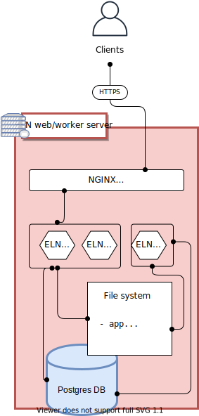
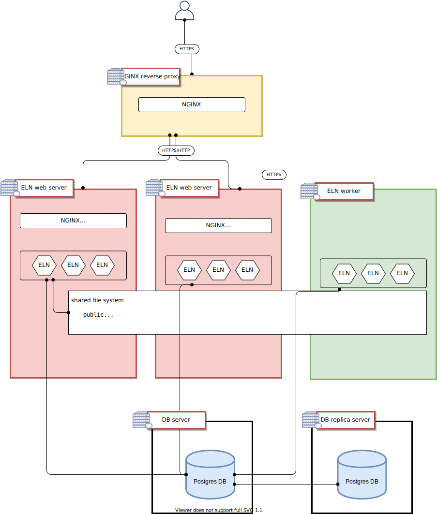

This documentation detailled an installation solution example of the the chemotion_ELN system and associated services on Ubuntu servers.


The chemotion_ELN is a web-application that needs the following elements:

* web-server and application server: NGINX with Passenger-phusion
* DB: postgresql (>10)
* the web application itself
* worker-applications to execute background tasks
* disk space to store attachment files from the users

The code for the web-application (server- and client- sides) and the workers is what we provide.

For a few users, all this components can be installed on a single machine (2 cpu s, 3GB memory) using the [installation script](https://git.scc.kit.edu/ComPlat/chemotion_eln_server/-/blob/development/scripts/install_production.sh) that will set up all these components and basic configurations.



In short the installation, will:

* install OS package dependencies
* install passenger
* create a new user
* install ruby and nodejs for this user
* create a postgresql DB
* copy the chemotion_ELN code and prepare basic config files
* do a capistrano app deploy
* config nginx (NB: no ssl set) and UFW

For more users, one can start to split the services onto distinct machines.



## Hardware Requirement
To install on a single machine for few users below is the minimum hardware requirement.
* 3GB RAM
* Dual Core
* 50GB hard disk 
* Ubuntu 20.04LTS or 18.04 LTS

For multiple machine configuration and splitting the services onto different machines below is the hardware requirement:
**ELN web server and worker server**:
* 3GB RAM
* Dual Core
* 10-20GB hard disk
* Ubuntu 20.04LTS or 18.04 LTS

**DB server**:
* 2GB RAM
* Dual Core
* 500GB hard disk or larger(depending upon the size of the metadata)
* Ubuntu 20.04LTS or 18.04 LTS

**ELN proxy server**:
* 2GB RAM
* Dual Core
* 8GB hard disk
* Ubuntu 20.04LTS or 18.04 LTS

**Chemspectra**:


## Nginx - Phusion passenger

The configuration files are at /etc/nginx/sites-enabled/ (symlinked from ../sites-available).
SSL use is recommended and should be set there.

To help with building the ssl config, one can use the [configurator from Mozilla](https://ssl-config.mozilla.org/)

Copy or edit your currently enabled config (/etc/nginx/sites-available/...) to change the listening port from 80 to 443 and set the path to the certificates for an example to:

```sh
server {
        listen 443 ssl http2;
        listen [::]:443 ssl http2;
# SSL config
        ssl_certificate /path/to/signed_cert_plus_intermediates;
        ssl_certificate_key /path/to/private_key;
        # ssl_trusted_certificate /path/to/interm;
        ssl_session_timeout 1d;
        ssl_session_cache shared:MozSSL:1m;

       ssl_protocols TLSv1.2 TLSv1.3;
       ssl_ciphers ECDHE-ECDSA-AES128-GCM-SHA256:ECDHE-RSA-AES128-GCM-SHA256:ECDHE-ECDSA-AES256-GCM-SHA384:ECDHE-RSA-AES256-GCM-SHA384:ECDHE-ECDSA-CHACHA20-POLY1305:ECDHE-RSA-CHACHA20-POLY1305:DHE-RSA-AES128-GCM-SHA256:DHE-RSA-AES256-GCM-SHA384;
       ssl_prefer_server_ciphers off;

       # HSTS
       add_header Strict-Transport-Security "max-age=63072000" always;

    .....


```

One can also add  a DH group:

generate the group with  `sudo openssl dhparam -out /etc/ssl/certs/dhparam.pem 4096`

then add it to the nginx server config
```sh
ssl_dhparam /etc/ssl/certs/dhparam.pem;
```

the rest of the config should be unchanged and similar to:
```sh

......

# application
        passenger_enabled on;
        client_max_body_size xxm;
        passenger_ruby /home/production/.rvm/wrappers/ruby-x.x.x/ruby;
        root /var/www/chemotion_ELN/current/public;

        server_name _;
        # server_name www.my-eln.tld my-eln.tld;

        location / {
            proxy_pass http://127.0.0.1:xxxx;
            proxy_http_version 1.1;
            proxy_set_header Host $http_host;
            proxy_set_header Upgrade $http_upgrade;
            proxy_set_header Connection "upgrade";
            proxy_buffering off;
        }

}

```

**force ssl redirection from port 80 to 443**:
With a sudo user, create a file  in  sites-available/. and enable it by linking it into sites-enabled/.

```sh
server {
  listen 80;
  listen [::]:80;
  server_name your_server_name;
  return      301  https://$server_name$request_uri ;
}

```


test the config (`sudo nginx -t -c /etc/nginx/nginx.conf`)  and restart/reload nginx (`sudo systemctl restart nginx `)


## Application File & Directory Structure


With this setup the application code is located at /var/www/chemotion/ELN/current
The installation script calls [Capistrano](https://capistranorb.com/documentation/overview/what-is-capistrano/) to deploy the Rails app. Because of that, the structure of application files is the following:


```sh
/var/www/chemotion_ELN/
├── current -> /var/www/chemotion_ELN/releases/202101XXXXXXXX
├── releases
│   ├── 202101XXXXXXXX
│   ├── 202101XXXXXXXX
│   └─── 202101XXXXXXXX
│       ├── app
│       ├── backup
│       │   ├── deploy_backup -> /var/www/chemotion_ELN/shared/backup/deploy_backup
│       │   ├── models
│       │   └── weekly_backup -> /var/www/chemotion_ELN/shared/backup/weekly_backup
│       ├── bin
│       ├── config
│       │   ├── data_collector_keys
│       │   ├── deploy
│       │   ├── environments
│       │   ├── initializers
│       │   ├── locales
│       │   └── unicorn
│       ├── db
│       │   ├── functions
│       │   ├── migrate
│       │   ├── seeds
│       │   ├── triggers
│       │   └── views
│       ├── lib
│       ├── log -> /var/www/chemotion_ELN/shared/log
│       ├── node_modules -> /var/www/chemotion_ELN/shared/node_modules
│       ├── public
│       │   ├── assets -> /var/www/chemotion_ELN/shared/public/assets
│       │   ├── images -> /var/www/chemotion_ELN/shared/public/images
│       │   ├── simulations -> /var/www/chemotion_ELN/shared/public/simulations
│       │   └── zip
│       ├── tmp
│       │   ├── cache -> /var/www/chemotion_ELN/shared/tmp/cache
│       │   ├── novnc_devices -> /var/www/chemotion_ELN/shared/tmp/novnc_devices
│       │   ├── pids -> /var/www/chemotion_ELN/shared/tmp/pids
│       │   ├── sockets -> /var/www/chemotion_ELN/shared/tmp/sockets
│       │   └── uploads -> /var/www/chemotion_ELN/shared/tmp/uploads
│       ├── uploads -> /var/www/chemotion_ELN/shared/uploads
│       └── vendor
│           └── assets
├── repo
│   ├── branches
│   ├── ...
│   └── refs
│       ├── .. heads
│       └ ..
└── shared
    ├── .env
    ├── backup
    │   ├── deploy_backup
    │   └── weekly_backup
    ├── config
    │   ├── database.yml
    │   └── storage.yml
    ├── log
    ├── node_modules
    │   ├─ ...
    │   ...
    │
    ├── public
    │   ├── assets
    │   │   ├── ...
    │   │   ├── ...ketcherails
    │   │  
    │   ├── images
    │   │   ├── ghs
    │   │   ├── images
    │   │   ├── ketcherails
    │   │   ├── molecules
    │   │   ├── qr
    │   │   ├── reactions
    │   │   ├── research_plans
    │   │   ├── samples
    │   │   ├── sprites
    │   │   ├── templates
    │   │   ├── thumbnail
    │   │   └── wild_card
    │   ├── ontologies
    │   ├── simulations
    │   └
    ├── tmp
    │   ├── cache
    │   ├── novnc_devices
    │   ├── pids
    │   ├── sockets
    │   └── uploads
    └── uploads


```
Configuration files for the application are in the *config* directory.
In the currently running application directory the configuration files ( _current/config/*.yml_ ) are linked from _shared/config/*yml_


The web and background-worker applications are started a reboot by executing the scrip /home/production/boot-ELN.sh from the crontab.
The ruby dependencies and node versions are also in the home directory.

```sh
/home/production
├── .nvm
│   └── ...
├── .rvm
│   └── ...
├── Backup
└── boot-ELN.sh

```


### File storage

Files uploaded by the users are stored in /var/www/chemotion_ELN/shared/uploads.
The path is defined in the storage.yml config.

### DB settings

Connection to the DB is set in _config/database.yml_.


## Multiple Machine Configuration

When splitting the tasks on several machines  ensure that the following is accessible to any web-app or worker-app instance

- DB
- uploaded user files
- images
- 
