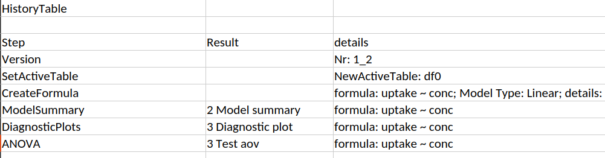

The file containing the results stores each conducted step in a *History*.
At the beginning the history is shown in a human readable form. Thereby, it is
easy to retrace each step with the respective configuration.

At the end of the results file the same history is stored in a JSON string.
This string can be used to replay the entire anaylsis.
First the dataset has to be imported into OpenStats. Afterwards, the JSON string
is pasted into the dedicated text box which can be found in the History tab.
Subsequently, clicking the *replay button* runs each step of the anaylsis.

import HistoryJSONTextBox from './HistoryJSONTextBox.png'
import Replay from './Replay.png'

  

    
  

  

    
  

